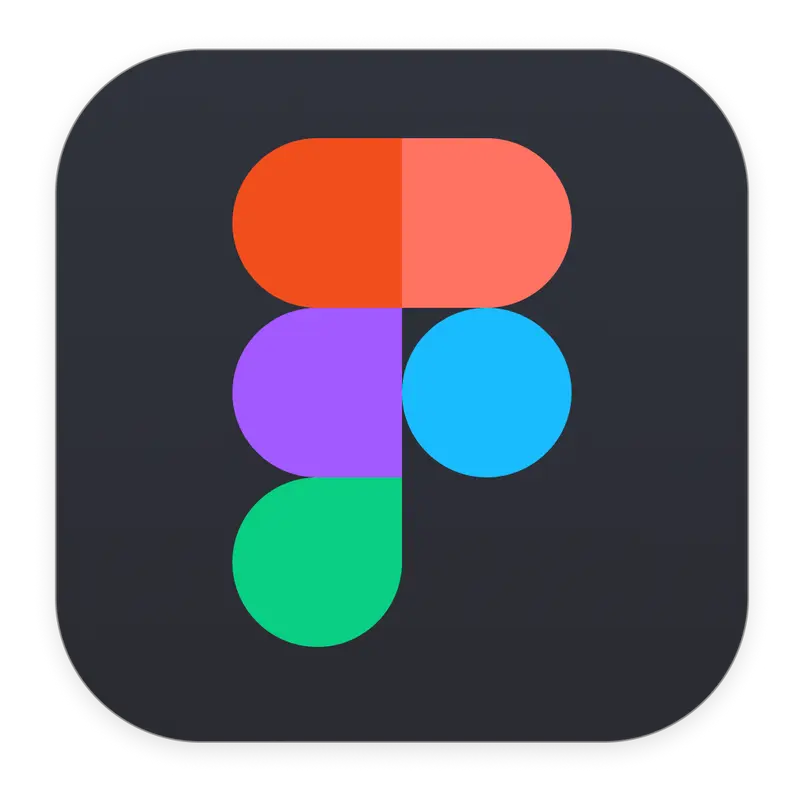

<!-- 
[Ana Caroline](https://github.com/anaaroch), [Jefferson França](https://github.com/Frans6), [Rafael Amancio](https://github.com/Rafael-gc), [Shaíne Oliveira](https://github.com/ShaineOliveira) e [Yago Passos](https://github.com/yagompassos)
-->

# Projeto Final

## Introdução 

## Aplicativo Escolhido <!-- (1) -->

## Planejamento de recursos (Cronogramas) <!-- (2) -->

No início do projeto, o grupo realizou reuniões para desenvolver um cronograma abrangente para a disciplina, estabelecendo datas para a conclusão de cada artefato em todas as entregas. Esta seção tem como objetivo apresentar a versão final do cronograma da disciplina, proporcionando uma visão detalhada das atividades realizadas e seus responsáveis.

A Tabela 1 abaixo sintetiza os cronogramas planejado e executado para os artefatos, oferecendo uma visão panorâmica do planejamento de recursos (Cronogramas) do projeto Skoob na disciplina de Requisitos de Software.

| Ponto de Controle | Atividade | Início Previsto | Fim Previsto | Autor(es) Previstos | Revisor(es) Previstos | Início Realizado | Fim Realizado | Autor(es) | Revisor(es) |
| :---------------: | :-------: | :-------------: | :----------: | :-----------------: | :-------------------: | :----: | :-: | :-------: | :---------: |
| 1 | Apresentações | 12/09 | 18/09 | [Ana Caroline](https://github.com/anaaroch), [Jefferson França](https://github.com/Frans6), [Rafael Amancio](https://github.com/Rafael-gc), [Shaíne Oliveira](https://github.com/ShaineOliveira) e [Yago Passos](https://github.com/yagompassos) | [Ana Caroline](https://github.com/anaaroch), [Jefferson França](https://github.com/Frans6), [Rafael Amancio](https://github.com/Rafael-gc), [Shaíne Oliveira](https://github.com/ShaineOliveira) e [Yago Passos](https://github.com/yagompassos) | 18/09 | 20/09 | [Shaíne Oliveira](https://github.com/ShaineOliveira) e [Yago Passos](https://github.com/yagompassos) | [Yago Passos](https://github.com/yagompassos) |
| 1 | Atas | 12/09 | 18/09 | [Yago Passos](https://github.com/yagompassos) | [Ana Caroline](https://github.com/anaaroch), [Jefferson França](https://github.com/Frans6), [Rafael Amancio](https://github.com/Rafael-gc), [Shaíne Oliveira](https://github.com/ShaineOliveira) e [Yago Passos](https://github.com/yagompassos) | 06/09 | 12/09 | [Yago Passos](https://github.com/yagompassos) | [Ana Caroline](https://github.com/anaaroch), [Jefferson França](https://github.com/Frans6), [Rafael Amancio](https://github.com/Rafael-gc) e [Shaíne Oliveira](https://github.com/ShaineOliveira) |
| 1 |  Cronograma | 12/09 | 18/09 | [Jefferson França](https://github.com/Frans6), [Shaíne Oliveira](https://github.com/ShaineOliveira) e [Yago Passos](https://github.com/yagompassos) | [Ana Caroline](https://github.com/anaaroch) | 11/09 | 20/09 | [Jefferson França](https://github.com/Frans6), [Shaíne Oliveira](https://github.com/ShaineOliveira) e [Yago Passos](https://github.com/yagompassos) | [Rafael Amancio](https://github.com/Rafael-gc) |
| 1 | Cronograma Realizado | 12/09 | 18/09 | [Jefferson França](https://github.com/Frans6) e [Shaíne Oliveira](https://github.com/ShaineOliveira) | [Rafael Amancio](https://github.com/Rafael-gc) | 15/09 | 15/09 | [Jefferson França](https://github.com/Frans6) e [Shaíne Oliveira](https://github.com/ShaineOliveira) | [Rafael Amancio](https://github.com/Rafael-gc) |
| 1 | Equipe | 12/09 | 18/09 | [Rafael Amancio](https://github.com/Rafael-gc) | [Jefferson França](https://github.com/Frans6) | 07/09 | 18/09 | [Ana Caroline](https://github.com/anaaroch), [Rafael Amancio](https://github.com/Rafael-gc) e [Shaíne Oliveira](https://github.com/ShaineOliveira) | [Ana Caroline](https://github.com/anaaroch) e [Shaíne Oliveira](https://github.com/ShaineOliveira) |
| 1 | Ferramentas | 12/09 | 18/09 | [Ana Caroline](https://github.com/anaaroch) | [Shaíne Oliveira](https://github.com/ShaineOliveira) | 15/09 | 18/09 | [Ana Caroline](https://github.com/anaaroch) | [Rafael Amancio](https://github.com/Rafael-gc) e [Shaíne Oliveira](https://github.com/ShaineOliveira) |
| 1 | GitPage | 12/09 | 18/09 |  [Rafael Amancio](https://github.com/Rafael-gc) | [Ana Caroline](https://github.com/anaaroch), [Jefferson França](https://github.com/Frans6), [Rafael Amancio](https://github.com/Rafael-gc), [Shaíne Oliveira](https://github.com/ShaineOliveira) e [Yago Passos](https://github.com/yagompassos) | 06/09 | 12/09 |[Jefferson França](https://github.com/Frans6) | [Ana Caroline](https://github.com/anaaroch), [Rafael Amancio](https://github.com/Rafael-gc), [Shaíne Oliveira](https://github.com/ShaineOliveira) e [Yago Passos](https://github.com/yagompassos) |
| 1 | Heatmap | 12/09 | 18/09 | [Ana Caroline](https://github.com/anaaroch), [Jefferson França](https://github.com/Frans6), [Rafael Amancio](https://github.com/Rafael-gc), [Shaíne Oliveira](https://github.com/ShaineOliveira) e [Yago Passos](https://github.com/yagompassos) | [Ana Caroline](https://github.com/anaaroch), [Jefferson França](https://github.com/Frans6), [Rafael Amancio](https://github.com/Rafael-gc), [Shaíne Oliveira](https://github.com/ShaineOliveira) e [Yago Passos](https://github.com/yagompassos) | 06/09 | 10/09 | [Ana Caroline](https://github.com/anaaroch), [Jefferson França](https://github.com/Frans6), [Rafael Amancio](https://github.com/Rafael-gc), [Shaíne Oliveira](https://github.com/ShaineOliveira) e [Yago Passos](https://github.com/yagompassos) | [Ana Caroline](https://github.com/anaaroch), [Jefferson França](https://github.com/Frans6), [Rafael Amancio](https://github.com/Rafael-gc), [Shaíne Oliveira](https://github.com/ShaineOliveira) e [Yago Passos](https://github.com/yagompassos) |
| 1 | Modelo Padrão para Artefatos | 12/09 | 18/09 | [Jefferson França](https://github.com/Frans6) | [Shaíne Oliveira](https://github.com/ShaineOliveira) | 05/09 | 05/09 | [Jefferson França](https://github.com/Frans6) | [Yago Passos](https://github.com/yagompassos) |
| 1 | Metodologia e Política de Commit | 12/09 | 18/09 | [Jefferson França](https://github.com/Frans6) e [Yago Passos](https://github.com/yagompassos) | [Ana Caroline](https://github.com/anaaroch) | 18/09 | 29/09 | [Jefferson França](https://github.com/Frans6) e [Yago Passos](https://github.com/yagompassos) | [Shaíne Oliveira](https://github.com/ShaineOliveira) e [Yago Passos](https://github.com/yagompassos) |
| 1 | Rich Pictures dos Integrantes | 12/09 | 18/09 | [Ana Caroline](https://github.com/anaaroch) e [Rafael Amancio](https://github.com/Rafael-gc) | [Yago Passos](https://github.com/yagompassos) | 15/09 | 15/09 | [Ana Caroline](https://github.com/anaaroch) | [Rafael Amancio](https://github.com/Rafael-gc) e [Shaíne Oliveira](https://github.com/ShaineOliveira) |
| 1 | Vídeo de apresentação |  18/09  |  18/09  | [Ana Caroline](https://github.com/anaaroch), [Jefferson França](https://github.com/Frans6), [Rafael Amancio](https://github.com/Rafael-gc), [Shaíne Oliveira](https://github.com/ShaineOliveira) e [Yago Passos](https://github.com/yagompassos) | [Ana Caroline](https://github.com/anaaroch), [Jefferson França](https://github.com/Frans6), [Rafael Amancio](https://github.com/Rafael-gc), [Shaíne Oliveira](https://github.com/ShaineOliveira) e [Yago Passos](https://github.com/yagompassos) | 20/09 | 20/09 | [Ana Caroline](https://github.com/anaaroch), [Jefferson França](https://github.com/Frans6), [Rafael Amancio](https://github.com/Rafael-gc), [Shaíne Oliveira](https://github.com/ShaineOliveira) e [Yago Passos](https://github.com/yagompassos) | [Ana Caroline](https://github.com/anaaroch), [Jefferson França](https://github.com/Frans6), [Rafael Amancio](https://github.com/Rafael-gc), [Shaíne Oliveira](https://github.com/ShaineOliveira) e [Yago Passos](https://github.com/yagompassos) |
| 1 | Correções da Entrega 1 | 22/09 | 26/09 | [Ana Caroline](https://github.com/anaaroch), [Jefferson França](https://github.com/Frans6), [Rafael Amancio](https://github.com/Rafael-gc), [Shaíne Oliveira](https://github.com/ShaineOliveira) e [Yago Passos](https://github.com/yagompassos) | [Ana Caroline](https://github.com/anaaroch), [Jefferson França](https://github.com/Frans6), [Rafael Amancio](https://github.com/Rafael-gc), [Shaíne Oliveira](https://github.com/ShaineOliveira) e [Yago Passos](https://github.com/yagompassos) | 22/09 | 26/09 | [Ana Caroline](https://github.com/anaaroch), [Jefferson França](https://github.com/Frans6), [Rafael Amancio](https://github.com/Rafael-gc), [Shaíne Oliveira](https://github.com/ShaineOliveira) e [Yago Passos](https://github.com/yagompassos) | [Ana Caroline](https://github.com/anaaroch), [Jefferson França](https://github.com/Frans6), [Rafael Amancio](https://github.com/Rafael-gc), [Shaíne Oliveira](https://github.com/ShaineOliveira) e [Yago Passos](https://github.com/yagompassos) |

 Tabela 1: Cronograma Final. (Fonte: Ana Rocha, 2023).

## Execução do projeto <!-- (3) -->
Percorrendo o projeto, a equipe esteve imersa em diversas fases para a conclusão do estudo de requisitos. Ao iniciar pelo **planejamento**, que teve início no dia 06/09, data descrita na [Ata de Reunião 00](../../planejamento/docs/atas/reuniao00.md), e perdurou até a [entrega](entregas.md) do dia 20/09. Nela, o grupo 6 dispôs os cronogramas apresentados no tópico do passado. Também escolhemos o nosso [aplicativo de estudo](../../planejamento/docs/pre_rastreabilidade/aplicativo_escolhido.md), dentre as várias [opções que os membros trouxeram](../../planejamento/docs/pre_rastreabilidade/lista_de_aplicativos.md). Outras coisas que desenvolvemos nessa etapa foi a definição da [metodologia](../../planejamento/docs/planejamento/metodologia.md) que a equipe escolheu para tocar o projeto e a [lista de ferramentas](../../planejamento/docs/planejamento/ferramentas.md) que pretendíamos utilizar.

A segunda etapa: do **desenvolvimento** do projeto, se estendeu do final do planejamento até sua [entrega](entregas.md) no dia 04/10. Nela, desenvolvemos o principal foco do estudo do projeto: os [requisitos](../../planejamento/docs/elicitacao/requisitos.md). Utilizamos 3 técnicas de elicitação e 3 técnicas de priorização de requisitos, todos os outros artefatos criados depois foram baseados neles e nessa etapa.

A fase de **Modelagem**, por ser mais longa, foi dividida em 2 entregas. Na primeira, utilizamos os requisitos elicitados para modelar técnicas para melhorar a visualização do aplicativo e suas funcionalidades. Aqui foram desenvolvidos os artefatos de [Cenários](../../planejamento/docs/modelagem/cenarios.md), [Léxicos](../../planejamento/docs/modelagem/lexico.md), [Use Case](../../planejamento/docs/modelagem/casos_de_uso.md) e [Especificação Suplementar](../../planejamento/docs/modelagem/especificacao_suplementar.md). Na sub-etapa de modelagem Ágil, referente a entrega 4, surgiram os artefatos [História de Usuário](../../planejamento/docs/modelagem/user_story.md), [Backlog](../../planejamento/docs/modelagem/backlog.md) e [NFR Framework](../../planejamento/docs/modelagem/nfr_framework.md). Todas essas 2 entregas perduraram do dia 09/10 até 06/11.

## Os resultados alcançados <!-- (4) -->

## Rewind do Projeto 

### Técnicas foram utilizadas na execução do projeto <!-- (5) em cada etapa do projeto com o(s) nome(s) do(s) participantes(s) do grupo que usou/usaram cada uma das técnicas) -->
A tabela 3 mostra a relação das técnicas foram utilizadas na execução do projeto em cada etapa do projeto com o(s) nome(s) do(s) participantes(s) do grupo que usou/usaram cada um das técnicas

| Entrega | Artefato | Técnicas | Autores | Revisores |
| :-----: | :------: | :------: | :-----: | :-------: |
| Planejamento | [Cronograma Planejado](https://requisitos-de-software.github.io/2023.2-Skoob/planejamento/cronograma/) | - | [Jefferson França](https://github.com/Frans6), [Shaíne Oliveira](https://github.com/ShaineOliveira), [Yago Passos](https://github.com/yagompassos) | [Rafael Amancio](https://github.com/Rafael-gc), [Ana Caroline](https://github.com/anaaroch) |
| Planejamento | [Cronograma Executado](https://requisitos-de-software.github.io/2023.2-Skoob/planejamento/cronograma_executado/) | - | [Jefferson França](https://github.com/Frans6) e [Shaíne Oliveira](https://github.com/ShaineOliveira) | [Rafael Amancio](https://github.com/Rafael-gc), [Ana Caroline](https://github.com/anaaroch), [Yago Passos](https://github.com/yagompassos) |
| Planejamento | [Ferramentas](https://requisitos-de-software.github.io/2023.2-Skoob/planejamento/ferramentas/) | - | [Ana Caroline](https://github.com/anaaroch) | [Shaíne Oliveira](https://github.com/ShaineOliveira), [Rafael Amancio](https://github.com/Rafael-gc) |
| Planejamento | [Metodologia](https://requisitos-de-software.github.io/2023.2-Skoob/planejamento/metodologia/) | Scrum adaptado e Kanban | [Jefferson França](https://github.com/Frans6) e [Yago Passos](https://github.com/yagompassos) | [Shaíne Oliveira](https://github.com/ShaineOliveira) e [Rafael Amancio](https://github.com/Rafael-gc) |
| Pré-Rastreabilidade | [Aplicativos Analisados](https://requisitos-de-software.github.io/2023.2-Skoob/pre_rastreabilidade/lista_de_aplicativos/) | Rich Picture | [Ana Caroline](https://github.com/anaaroch) | [Jefferson França](https://github.com/Frans6), [Shaíne Oliveira](https://github.com/ShaineOliveira), [Rafael Amancio](https://github.com/Rafael-gc) |
| Pré-Rastreabilidade | [Aplicativo Escolhido](https://requisitos-de-software.github.io/2023.2-Skoob/pre_rastreabilidade/aplicativo_escolhido/) | Rich Picture | [Ana Caroline](https://github.com/anaaroch), [Jefferson França](https://github.com/Frans6) e [Shaíne Oliveira](https://github.com/ShaineOliveira) | [Rafael Amancio](https://github.com/Rafael-gc) |
| Elicitação de Requisitos | [Requisitos Elicitados](https://requisitos-de-software.github.io/2023.2-Skoob/elicitacao/requisitos/) | Brainstorming, Introspecção e Observação | [Shaíne Oliveira](https://github.com/ShaineOliveira) e [Rafael Amancio](https://github.com/Rafael-gc) | [Ana Caroline](https://github.com/anaaroch) e [Yago Passos](https://github.com/yagompassos) |
| Elicitação de Requisitos | [Brainstorming](https://requisitos-de-software.github.io/2023.2-Skoob/elicitacao/brainstorming/) | Brainstorming | [Ana Caroline](https://github.com/anaaroch), [Jefferson França](https://github.com/Frans6), [Rafael Amancio](https://github.com/Rafael-gc) e [Yago Passos](https://github.com/yagompassos) | [Ana Caroline](https://github.com/anaaroch), [Rafael Amancio](https://github.com/Rafael-gc) e [Yago Passos](https://github.com/yagompassos) |
| Elicitação de Requisitos | [Observação](https://requisitos-de-software.github.io/2023.2-Skoob/elicitacao/observacao/) | Observação | [Ana Caroline](https://github.com/anaaroch) e [Yago Passos](https://github.com/yagompassos) | [Ana Caroline](https://github.com/anaaroch), [Jefferson França](https://github.com/Frans6) e [Shaíne Oliveira](https://github.com/ShaineOliveira) |
| Elicitação de Requisitos | [Introspecção](https://requisitos-de-software.github.io/2023.2-Skoob/elicitacao/introspeccao/) | Introspecção | [Rafael Amancio](https://github.com/Rafael-gc) |[Shaíne Oliveira](https://github.com/ShaineOliveira) e [Yago Passos](https://github.com/yagompassos) |
| Elicitação de Requisitos (Priorização) | [First Thing First](https://requisitos-de-software.github.io/2023.2-Skoob/elicitacao/first_things_first/) | First Thing First | [Ana Caroline](https://github.com/anaaroch) e [Yago Passos](https://github.com/yagompassos) | [Ana Caroline](https://github.com/anaaroch), [Rafael Amancio](https://github.com/Rafael-gc) e [Yago Passos](https://github.com/yagompassos) |
| Elicitação de Requisitos (Priorização) | [Moscow](https://requisitos-de-software.github.io/2023.2-Skoob/elicitacao/moscow/) | Moscow | [Shaíne Oliveira](https://github.com/ShaineOliveira), [Rafael Amancio](https://github.com/Rafael-gc) e [Yago Passos](https://github.com/yagompassos) | [Ana Caroline](https://github.com/anaaroch), [Shaíne Oliveira](https://github.com/ShaineOliveira), [Rafael Amancio](https://github.com/Rafael-gc) e [Yago Passos](https://github.com/yagompassos) |
| Elicitação de Requisitos (Priorização) | [Three-level Scale](https://requisitos-de-software.github.io/2023.2-Skoob/elicitacao/three_level_scale/) | Three-level Scale | [Ana Caroline](https://github.com/anaaroch), [Jefferson França](https://github.com/Frans6) e [Rafael Amancio](https://github.com/Rafael-gc) | [Ana Caroline](https://github.com/anaaroch) e [Yago Passos](https://github.com/yagompassos) |
| Elicitação de Requisitos | [Perfil do Usuário](https://requisitos-de-software.github.io/2023.2-Skoob/elicitacao/perfil_do_usuario/) | Questionário | [Ana Caroline](https://github.com/anaaroch) e [Jefferson França](https://github.com/Frans6) | [Rafael Amancio](https://github.com/Rafael-gc) e [Yago Passos](https://github.com/yagompassos) |
| Modelagem | [Cenários](https://requisitos-de-software.github.io/2023.2-Skoob/modelagem/cenarios/) | Cenários | [Ana Caroline](https://github.com/anaaroch), [Jefferson França](https://github.com/Frans6) e [Shaíne Oliveira](https://github.com/ShaineOliveira) | [Ana Caroline](https://github.com/anaaroch) e [Shaíne Oliveira](https://github.com/ShaineOliveira) |
| Modelagem | [Casos de Uso](https://requisitos-de-software.github.io/2023.2-Skoob/modelagem/casos_de_uso/) | Casos de Uso | [Jefferson França](https://github.com/Frans6) | [Yago Passos](https://github.com/yagompassos) |
| Modelagem | [Especificação Suplementar](https://requisitos-de-software.github.io/2023.2-Skoob/modelagem/especificacao_suplementar/) | Especificação Suplementar | [Ana Caroline](https://github.com/anaaroch) | [Rafael Amancio](https://github.com/Rafael-gc) |
| Modelagem | [Léxicos](https://requisitos-de-software.github.io/2023.2-Skoob/modelagem/lexico/) | Léxicos | [Ana Caroline](https://github.com/anaaroch), [Rafael Amancio](https://github.com/Rafael-gc) e [Yago Passos](https://github.com/yagompassos) | [Ana Caroline](https://github.com/anaaroch), [Jefferson França](https://github.com/Frans6) e [Yago Passos](https://github.com/yagompassos) |
| Modelagem | [NFR Framework](https://requisitos-de-software.github.io/2023.2-Skoob/modelagem/nfr_framework/) | NFR Framework | [Ana Caroline](https://github.com/anaaroch) e [Shaíne Oliveira](https://github.com/ShaineOliveira) | [Ana Caroline](https://github.com/anaaroch), [Shaíne Oliveira](https://github.com/ShaineOliveira), [Rafael Amancio](https://github.com/Rafael-gc) e [Yago Passos](https://github.com/yagompassos) |
| Modelagem | [Backlog](https://requisitos-de-software.github.io/2023.2-Skoob/modelagem/backlog/) | - | [Ana Caroline](https://github.com/anaaroch) e [Rafael Amancio](https://github.com/Rafael-gc) | [Jefferson França](https://github.com/Frans6), [Shaíne Oliveira](https://github.com/ShaineOliveira) e [Yago Passos](https://github.com/yagompassos) |
| Modelagem | [Histórias de Usuários](https://requisitos-de-software.github.io/2023.2-Skoob/modelagem/user_story/) | Histórias de Usuários | [Jefferson França](https://github.com/Frans6) e [Yago Passos](https://github.com/yagompassos) | [Jefferson França](https://github.com/Frans6) e [Yago Passos](https://github.com/yagompassos) |
| Pós-Rastreabilidade | [Backward From](https://requisitos-de-software.github.io/2023.2-Skoob/pos_rastreabilidade/backward/) | Backward-From, Meta-Modelo de Toranzo | [Ana Caroline](https://github.com/anaaroch) e [Shaíne Oliveira](https://github.com/ShaineOliveira) | [Ana Caroline](https://github.com/anaaroch), [Shaíne Oliveira](https://github.com/ShaineOliveira) e [Yago Passos](https://github.com/yagompassos) |
| Pós-Rastreabilidade | [Forward From](https://requisitos-de-software.github.io/2023.2-Skoob/pos_rastreabilidade/forward/) | Forward-From | [Jefferson França](https://github.com/Frans6) e [Yago Passos](https://github.com/yagompassos) | [Ana Caroline](https://github.com/anaaroch), [Jefferson França](https://github.com/Frans6), [Shaíne Oliveira](https://github.com/ShaineOliveira) e [Yago Passos](https://github.com/yagompassos) |
| Pós-Rastreabilidade | [Matriz de Rastreabilidade](https://requisitos-de-software.github.io/2023.2-Skoob/pos_rastreabilidade/matriz/) | Matriz de Rastreabilidade | [Rafael Amancio](https://github.com/Rafael-gc) e [Yago Passos](https://github.com/yagompassos) | [Jefferson França](https://github.com/Frans6), [Rafael Amancio](https://github.com/Rafael-gc) e [Yago Passos](https://github.com/yagompassos) |

 Tabela 3 - Artefatos e Técnicas. (Shaíne Oliveira, 2023).

### Artefatos criados no projeto <!--  (6) com revisor e autor -->
A tabela _ mostra a relação 

| Atividade | Entrega | Revisão | Autor(es) | Revisor(es) |
| :-------: | :-----: | :-----: | :-------: | :---------: |
|   texto   |  texto  |  texto  |   texto   |    texto    |
|   texto   |  texto  |  texto  |   texto   |    texto    |
|   texto   |  texto  |  texto  |   texto   |    texto    |

 Tabela _: Exemplo de Tabela. (Fonte: Jefferson França, 2023).

### Método de verificação e validação dos artefatos <!--  (7) com revisor e autor -->
A tabela _ mostra a relação

| Atividade | Entrega | Revisão | Autor(es) | Revisor(es) |
| :-------: | :-----: | :-----: | :-------: | :---------: |
|   texto   |  texto  |  texto  |   texto   |    texto    |
|   texto   |  texto  |  texto  |   texto   |    texto    |
|   texto   |  texto  |  texto  |   texto   |    texto    |

 Tabela _: Exemplo de Tabela. (Fonte: Jefferson França, 2023).

### Ferramentas  <!-- (8)-->

A tabela 4 mostra a relação das ferramentas e onde elas foram utilizadas em cada etapa do projeto.

|  Logo  |  Nome da Ferramenta  |  Descrição  |  Finalidade  | Etapa |
|  :--:  |  :----------------:  |  :-------:  |  :--------:  | :---: |
|      |  Figma <a id="a" href="#aa">[1]</a> | O Figma é um editor gráfico vetorial e ferramenta de prototipagem para projetos de design. <a id="j" href="#jj">[10]</a> | Usado para elaborar o protótipo.  | [5.2: V&V (Validação)](../validacao/prototipagem.md) |
|    |  GitHub <a id="b" href="#bb">[2]</a> | O GitHub é uma plataforma de hospedagem de código-fonte e arquivos que utiliza controle de versão com o Git. <a id="k" href="#kk">[11]</a> | Usado para manter e gerenciar o repositório do projeto, bem como hospedar a GitPage.  | [Todas as etapas](https://github.com/Requisitos-de-Software/2023.2-Skoob) |
|      |  LucidChart <a id="c" href="#cc">[3]</a> | O Lucidchart é uma aplicação web para diagramação. <a id="l" href="#ll">[12]</a> | Usado para criar os Rich Pictures dos aplicativos analisados e o escolhido para estudo, os SIG's do NFR Framework e o diagrama de Casos de Uso. | [1: Planejamento (Pré-rastreabilidade)](../pre_rastreabilidade/lista_de_aplicativos.md)   [4: Modelagem](../modelagem/casos_de_uso.md) |
|      |  MkDocs <a id="d" href="#dd">[4]</a> | MkDocs é um gerador de sites estáticos, rápido e simples, voltado para a construção de documentação de projetos. <a id="d" href="#dd">[4]</a> | Usado para criar e realizar os deploys de atualizações da GitPage. | [Todas as etapas](../index.md) |
|      |  Teams <a id="e" href="#ee">[5]</a> | Microsoft Teams é uma plataforma integrada para comunicação e colaboração, como bate-papo e videoconferências. <a id="m" href="#mm">[13]</a> | Usado para realizar e registrar as reuniões do grupo.  | Todas as etapas |
|      |  Trello <a id="f" href="#ff">[6]</a> | O Trello é uma aplicação de gestão de projetos online. <a id="n" href="#nn">[14]</a> | Usado para a organização pessoal da equipe em relação às tarefas e demandas ao longo do projeto.  | Todas as etapas |
|      |  VSCode <a id="g" href="#gg">[7]</a> | O Visual Studio Code é um editor de código-fonte. <a id="o" href="#oo">[15]</a> | Programa usado para desenvolver e administrar as modificações na GitPage do projeto.  | Todas as etapas |
|    |  WhatsApp <a id="h" href="#hh">[8]</a> | O WhatsApp é um aplicativo de mensagens instantâneas e chamadas de voz para smartphones. <a id="p" href="#pp">[16]</a> | Usado para facilitar a comunicação constante entre os integrantes do grupo. | Todas as etapas |
|      |  YouTube <a id="i" href="#ii">[9]</a> | O YouTube é uma plataforma de compartilhamento de vídeos. <a id="q" href="#qq">[7]</a> | Usado para hospedar as gravações do projeto.  | Todas as etapas |
|      |  Google Sheets <a id="r" href="#rr">[18]</a> | O Google Sheets é um editor de planilhas. <a id="s" href="#ss">[19]</a> | Usado para criar a tabela utilizada na técnica de priorização de requisitos First Things First.  | [2: Elicitação (Priorização)](../elicitacao/first_things_first.md) |
|      |  Google Forms <a id="t" href="#tt">[20]</a> | Google Forms é um aplicativo de gerenciamento de pesquisas,para coletar informações sobre outras pessoas. <a id="u" href="#uu">[21]</a> | Utilizado para criar e acompanhar a coleta de dados do questionário para a elaboração do ṕerfil de usuários. | [2: Elicitação](../elicitacao/perfil_do_usuario.md) |

 Tabela 4: Descrição das ferramentas do projeto. (Fonte: Ana Rocha, 2023).

### Vídeos das apresentações de cada etapa <!-- (9) com o(s) nome(s) do(s) participantes(s) do grupo que participaram das gravações). -->
A tabela _ mostra a relação dos vídeos das apresentações de cada etapa (9) com o(s) nome(s) do(s) participantes(s) do grupo que participaram das gravações.

| Atividade | Entrega | Revisão | Autor(es) | Revisor(es) |
| :-------: | :-----: | :-----: | :-------: | :---------: |
|   texto   |  texto  |  texto  |   texto   |    texto    |
|   texto   |  texto  |  texto  |   texto   |    texto    |
|   texto   |  texto  |  texto  |   texto   |    texto    |

 Tabela _: Exemplo de Tabela. (Fonte: Jefferson França, 2023).

## Bibliografia

<a id="aa" href="#a">[1]</a> FIGMA. Disponível em: [Figma](https://www.figma.com/). Acesso em: 18 de Setembro de 2023. 
<a id="bb" href="#b">[2]</a> GITHUB. Disponível em: [GitHub](https://github.com/). Acesso em: 15 de Setembro de 2023. 
<a id="cc" href="#c">[3]</a> LUCIDCHART. Disponível em: [LucidChart](https://www.lucidchart.com/). Acesso em: 26 de Setembro de 2023. 
<a id="dd" href="#d">[4]</a> MKDOCS. Disponível em: [MkDocs](https://www.mkdocs.org/). Acesso em: 18 de Setembro de 2023. 
<a id="ee" href="#e">[5]</a> TEAMS. Disponível em: [Teams](https://www.microsoft.com/pt-br/microsoft-teams/). Acesso em: 15 de Setembro de 2023. 
<a id="ff" href="#f">[6]</a> TRELLO. Disponível em: [Trello](https://trello.com/). Acesso em: 26 de Setembro de 2023. 
<a id="gg" href="#g">[7]</a> VSCODE. Disponível em: [VSCode](https://code.visualstudio.com/). Acesso em: 15 de Setembro de 2023. 
<a id="hh" href="#h">[8]</a> WHATSAPP. Disponível em: [WhatsApp](https://www.whatsapp.com/). Acesso em: 15 de Setembro de 2023. 
<a id="ii" href="#i">[9]</a> YOUTUBE. Disponível em: [YouTube](https://youtube.com/). Acesso em: 15 de Setembro de 2023. 
<a id="jj" href="#j">[10]</a> FIGMA. Disponível em: [Wikipédia](https://pt.wikipedia.org/wiki/Figma). Acesso em: 03 de Dezembro de 2023. 
<a id="kk" href="#k">[11]</a> GITHUB. Disponível em: [Wikipédia](https://pt.wikipedia.org/wiki/GitHub). Acesso em: 03 de Dezembro de 2023. 
<a id="ll" href="#l">[12]</a> LUCIDCHART. Disponível em: [Wikipédia](https://en.wikipedia.org/wiki/Lucidchart). Acesso em: 03 de Dezembro de 2023. 
<a id="mm" href="#m">[13]</a> TEAMS. Disponível em: [Wikipédia](https://pt.wikipedia.org/wiki/Microsoft_Teams). Acesso em: 03 de Dezembro de 2023. 
<a id="nn" href="#n">[14]</a> TRELLO. Disponível em: [Wikipédia](https://pt.wikipedia.org/wiki/Trello). Acesso em: 03 de Dezembro de 2023. 
<a id="oo" href="#o">[15]</a> VSCODE. Disponível em: [Wikipédia](https://pt.wikipedia.org/wiki/Visual_Studio_Code). Acesso em: 03 de Dezembro de 2023. 
<a id="pp" href="#p">[16]</a> WHATSAPP. Disponível em: [Wikipédia](https://pt.wikipedia.org/wiki/WhatsApp). Acesso em: 03 de Dezembro de 2023. 
<a id="qq" href="#q">[17]</a> YOUTUBE. Disponível em: [Wikipédia](https://pt.wikipedia.org/wiki/YouTube). Acesso em: 03 de Dezembro de 2023. 
<a id="rr" href="#r">[18]</a> GOOGLE SHEETS. Disponível em: [Google Sheets](https://docs.google.com/spreadsheets). Acesso em: 05 de Dezembro de 2023. 
<a id="ss" href="#s">[19]</a> GOOGLE SHEETS. Disponível em: [Wikipédia](https://pt.wikipedia.org/wiki/Google_Sheets). Acesso em: 05 de Dezembro de 2023. 
<a id="tt" href="#t">[20]</a> GOOGLE FORMS. Disponível em: [Google Forms](https://www.google.com/forms/about/). Acesso em: 05 de Dezembro de 2023. 
<a id="uu" href="#u">[21]</a> GOOGLE FORMS. Disponível em: [Wikipédia](https://pt.wikipedia.org/wiki/Google_Forms). Acesso em: 05 de Dezembro de 2023. 

## Histórico de Versão

| Versão | Data de execução | Data prevista de revisão |       Descrição      |         Autor(es)      |       Revisado          |
| :----: | :--------------: | :-------------: | :------------------------: | :----------------: | :-----------: |
| `1.0`  |    05/12/2023    |   06/12/2023      |   Criação do Artefato    | [Yago Passos](https://github.com/yagompassos)  |  |
| `1.1`  |    05/12/2023    |   06/12/2023      |   Seção de Etapas    | [Yago Passos](https://github.com/yagompassos) |  |
| `1.2`  |    05/12/2023    |   06/12/2023   |   Adiciona tabela de artefatos e técnicas     | [Shaíne Oliveira](https://github.com/ShaineOliveira) |  |
| `1.3`  |    05/12/2023    |   06/12/2023    |   Seção de Ferramentas    | [Ana Caroline](https://github.com/anaaroch_)  |  |
| `1.4`  |    06/12/2023    |   06/12/2023    |   Seção de Recursos    | [Ana Caroline](https://github.com/anaaroch_)  |  |
| `1.5`  |    dd/mm/aaaa    |   dd/mm/aaaa    |   Descrição do que foi feito    | Nome do Autor |  |

### Verificação

| Data de Revisão | Cobertura de Versões  |          Técnica         |     Revisor(es)    |
| :------------: | :-------------: | :--------------------------: |  :---------------: |
<!-- |   dd/mm/aaaa   |    `1.0`   |    [Elaboração em pares](../verificacao/revisoes.md)      |  Nome do Revisor | -->
