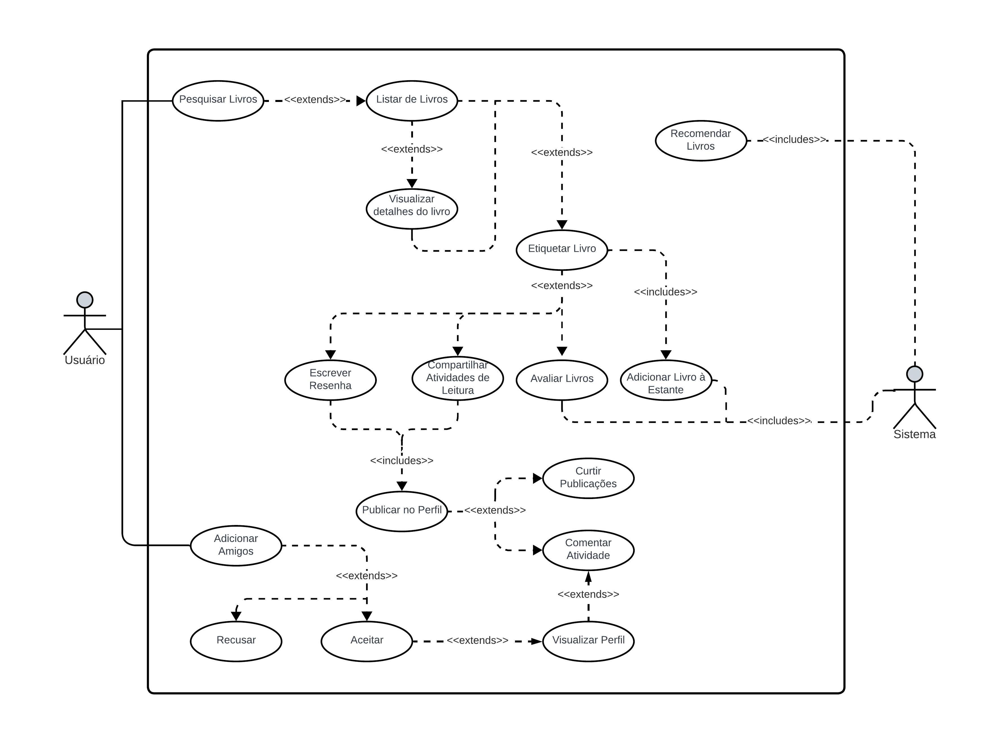

# Casos de Uso

## Introdução

Diagramas de casos de uso descrevem o que o sistema faz do ponto de vista do usuário, destacando suas principais funcionalidades e como os usuários interagem com ele. Ele não entra em detalhes técnicos, concentrando-se nas ações do usuário. Esse artefato é frequentemente derivado da especificação de requisitos e pode servir como base para o documento de requisitos do sistema.

## Componentes e Símbolos

Utilizando o software de diagramação LucidChart, elaboramos os diagramas de casos de uso. Para uma melhor compreensão dos diagramas apresentados neste artefato, foi desenvolvida uma legenda, Figura 1, que esclarece o significado de cada elemento presente nos diagramas.

  

Figura 1 - Legenda diagramas. (Fonte: Jefferson França. 2023)

### Atores

Em um diagrama de casos de uso, "atores" são entidades externas (como usuários ou sistemas) que interagem com o sistema para realizar ações específicas. Eles ajudam a identificar as interações essenciais entre o sistema e seu ambiente.

### Cenário

Em um diagrama de casos de uso, um "cenário" descreve uma sequência de eventos que ilustra como um ou mais casos de uso específicos são executados. Os cenários fornecem detalhes sobre como os atores interagem com o sistema e o que acontece em diferentes etapas de uma funcionalidade, ajudando a compreender o comportamento do sistema a partir da perspectiva do usuário.

No contexto de um diagrama de casos de uso, é essencial que todos os casos de uso descritos estejam incluídos nos cenários. Caso contrário, esses casos de uso serão considerados fora do escopo do sistema

### Comunicação

Em um diagrama de casos de uso, "comunicação" se refere à forma como os casos de uso interagem.

- "Extend" (estender) descreve cenários opcionais que ampliam um caso de uso base em circunstâncias específicas.
- "Include" (incluir) representa funcionalidades compartilhadas por vários casos de uso, evitando duplicação.
  
Essas relações ajudam a organizar e tornar os diagramas mais eficientes.

### Caso de Uso

Em um diagrama de casos de uso, um "caso de uso" representa uma funcionalidade ou interação específica que o sistema oferece aos usuários ou atores externos. Ele descreve o que o sistema faz, sem entrar em detalhes técnicos, e foca nas ações e interações que os atores têm com o sistema. Os casos de uso ajudam a definir os requisitos funcionais do sistema e a documentar as principais funcionalidades que o sistema deve suportar.

## Casos de Uso

  

Figura 2 - Diagrama de casos de uso. (Fonte: Jefferson França. 2023)

### UC01. Adicionar livro à estante

| UC01 | Adicionar Livro à Estante |
| -: | :- |
| **Atores** | Usuário |
| **Frequência de uso** | Alta |
| **Descrição** | Este caso de uso representa a ação de um usuário adicionar um livro à sua estante pessoal no aplicativo Skoob. A estante é onde o usuário pode acompanhar seus livros lidos, em leitura e desejados. |
| **Requisitos** |  Pesquisar um livro.   Selecionar um livro   Etiquetar livro  |
| **Condição de entrada** | Pesquisar o livro desejado. |
| **Fluxo principal** | <b>Fluxo 1 - FEP1 </b> <ol> <li> O usuário pesquisa um livro no aplicativo. <li> O usuário seleciona o livro desejado na lista de resultados de pesquisa. <li> O usuário define qual etiqueta ele vai atribuir ao livro. <li> O usuário escolhe uma etiqueta (por exemplo, "Lido", "Lendo", "Desejo Ler", etc.). <li> Dependendo da etiqueta escolhida, o sistema pode solicitar informações adicionais relacionadas a essa etiqueta. Por exemplo, se a etiqueta for "Lido", o sistema pode pedir uma avaliação ou uma resenha do livro. <li> O usuário fecha a aba de etiquetagem e o livro é adicionado à estante. </ol> |
| **Fluxos alternativos** | <b>Fluxo 1 - FEA1 </b><ol> <li> O usuário pesquisa um livro no aplicativo. <li> O usuário seleciona o livro desejado na lista de resultados de pesquisa. <li> O usuário visualiza os detalhes do livros desejado. <li> O usuário define qual etiqueta ele vai atribuir ao livro. <li> O usuário escolhe uma etiqueta (por exemplo, "Lido", "Lendo", "Desejo Ler", etc.). <li> Dependendo da etiqueta escolhida, o sistema pode solicitar informações adicionais relacionadas a essa etiqueta. Por exemplo, se a etiqueta for "Desejo Ler", o sistema pergunta quando ele quer ler. <li> O usuário fecha a aba de etiquetagem e o livro é adicionado à estante. </ol> |
| **Fluxos de exceção** | <b>Fluxo 1 - FE01 </b> <ol> <li> O usuário pesquisa um livro no aplicativo. <li> O livro não é encontrado pelo sistema </ol>
| **Pós condições** | O usuário tem o livro adicionado a sua estante. |
| **Data da criação** | 22/10/2023 |
| **Rastreabilidade** | OB02, OB03 e IN08 |

 Tabela 1: Especificação do caso de uso: Adicionar Livro à Estante. (Fonte: Jefferson França. 2023).

### UC02. Escrever Resenha

| UC02 | Escrever Resenha |
| -: | :- |
| **Atores** | Usuário |
| **Frequência de uso** | Média |
| **Descrição** | Este caso de uso representa a ação de um usuário escrever uma resenha de um livro já lido. A resenha é publicada em seu perfil onde outros usuários podem ter acesso. |
| **Requisitos** | Etiqueta do Livro como "Lido". |
| **Condição de entrada** | Selecionar livro na estante. |
| **Fluxo principal** | <b>Fluxo 1 - FEP1 </b> <ol> <li> O usuário navega até seu perfil. <li> O usuário acessa sua estante. <li> O usuário seleciona um livro que possui a etiqueta marcada como "Lido". <li> O usuário clica "Resenha". <li> O usuário clica em "Comente sua leitura". <li> O usuário define um título da resenha e escreve sua resenha.  <li> O usuário publica sua resenha. </ol> |
| **Fluxos alternativos** | <b>Fluxo 1 - FEP1 </b> <ol> <li> O usuário pesquisa um livro no aplicativo. <li> O usuário seleciona o livro desejado na lista de resultados de pesquisa. <li> O usuário define qual etiqueta ele vai atribuir ao livro. <li> O usuário define a etiqueta como "Lido". <li> O usuário avalia o livro por meio das estrelas. <li> O usuário clica em "Resenha". <li> O usuário clica em "Comente sua leitura". <li> O usuário publica sua resenha</ol> |
| **Fluxos de exceção** | <b>Fluxo 1 - FE01 </b> <ol> <li> O usuário pesquisa um livro no aplicativo. <li> O livro não é encontrado pelo sistema </ol>
| **Pós condições** |  |
| **Data da criação** | 22/10/2023 |
| **Rastreabilidade** |  |

 Tabela 1: Especificação do caso de uso: Adicionar Livro à Estante. (Fonte: Jefferson França. 2023).

## Bibliografia

<a id="aa" href="#a">[1]</a> IMAGEM. Disponível em: [Imagem](https://pt.wikipedia.org/wiki/Imagem). Acesso em: 05 de Setembro de 2023.

## Histórico de Versão

| Versão | Data de execução | Data de revisão |      Descrição      |                   Autor(es)                   |                  Revisor(es)                  |
| :----: | :--------------: | :-------------: | :-----------------: | :-------------------------------------------: | :-------------------------------------------: |
| `1.0`  |    23/10/2023    |   24/10/2023    | Criação do artefato | [Jefferson França](https://github.com/Frans6) | [Yago Passos](https://github.com/yagompassos) |

